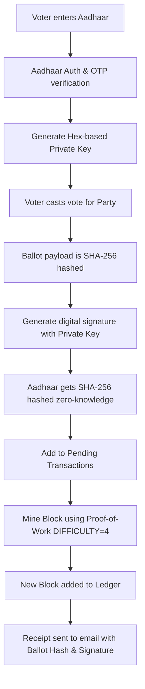

# 🗳️ BlockVote: Secure Blockchain-Based E-Voting System

> **Hackathon Project Submission & Technical Pitch Document**  
> *A decentralized, tamper-proof, and verifiable digital voting infrastructure simulator designed to restore trust in democratic elections.*

---

## 📌 1. Executive Summary

In traditional democratic systems, elections are plagued by vulnerabilities: physical ballot tampering, centralized database manipulation, voter fraud, and a lack of individual auditability. **BlockVote** is a blockchain-based e-voting simulator built to solve these issues. Leveraging **SHA-256 cryptographic chaining**, **Proof-of-Work (PoW)** consensus, **Merkle Tree validation**, and **Zero-Knowledge Voter Identity Hashing**, BlockVote ensures that every vote cast is immutable, anonymous, and verifiable. 

Designed with a high-fidelity cyberpunk glassmorphic UI, the application includes simulation tools to demonstrate both **ledger tampering** (external attack vectors) and **self-healing mechanics** (restoring ledger integrity from secure backups), making it a compelling, interactive showcase of blockchain's application in public governance.

---

## 🛑 2. The Problem Statement

Current digital and paper-based voting systems suffer from four fundamental flaws:
1. **Centralized Points of Failure:** Centralized databases are vulnerable to insider manipulation, database administrators (DBAs) rewriting history, or state-sponsored cyberattacks.
2. **The Anonymity vs. Uniqueness Dilemma:** Traditional systems find it difficult to guarantee that a voter only votes once without storing their identity alongside their ballot, compromising ballot secrecy.
3. **Lack of Independent Auditability:** Once a voter submits a ballot, they must blindly trust the centralized authority that their vote was recorded and counted accurately.
4. **Vulnerability to Tampering:** Electronic Voting Machines (EVMs) and digital databases lack visible, cryptographic proof that the data has not been modified post-election.

---

## 💡 3. The BlockVote Solution

BlockVote resolves these issues using decentralized ledger technology (DLT) and cryptographic primitives:



### 🔒 Core Pillars of the Architecture

*   **Cryptographic Immutability:** Votes are chained chronologically using SHA-256 hashes. Each block contains the hash of the previous block, creating a chain where any retro-active modification invalidates all subsequent block hashes.
*   **Merkle Tree Transaction Verification:** Instead of hashing transactions linearly, BlockVote computes a Merkle Root. This allows logarithmic verification of whether a specific ballot is present in a block, dramatically optimizing space and audit speed.
*   **Zero-Knowledge Voter Privacy:** To comply with privacy standards, BlockVote stores the SHA-256 hash of the voter's Aadhaar number (`aadhaar_hash`), rather than the raw Aadhaar. This prevents double-voting by matching hashes, while making it impossible to reverse-engineer the voter's identity from the blockchain.
*   **Proof-of-Work Consensus:** Blocks are added to the chain only after a mining simulation resolves a computational puzzle (finding a nonce that produces a block hash with 4 leading zeros). This represents the resource cost required to secure a distributed ledger against spam and rewrite attacks.
*   **Dynamic Dual-Factor Verification & Receipts:** Integrates SMTP to deliver One-Time Passwords (OTPs) and private keys dynamically to the voter. Upon casting, an automated HTML email receipt containing the unique `ballot_hash` and `signature` is sent to the voter.
*   **Interactive Simulation Dashboard:** To prove the resilience of the blockchain, administrators can manually tamper with votes (changing parties in mined blocks) and watch the validation engine immediately flag the ledger as compromised. The system can then trigger a self-healing protocol to restore chain integrity from a secure backup.

---

## 🛠️ 4. Technical Stack

*   **Backend:** Python 3.x, Flask (Microframework)
*   **Database & Storage:** JSON-based persistent ledgers with automated validation backups
*   **Cryptography:** Python `hashlib` (SHA-256), custom Merkle Root computation
*   **SMTP Services:** Python `smtplib`, `MIMEMultipart` (configured for secure TLS email dispatch)
*   **Frontend UI:** Cyberpunk Glassmorphic Theme (custom responsive CSS, Inter & Rajdhani Google Fonts, dynamic mining animations, and interactive chain explorer)

---

## 📐 5. Detailed Blockchain Implementation

### A. Block Structure
Every block is represented by the following structure:
```json
{
  "index": 1,
  "timestamp": "2026-06-22T15:20:00Z",
  "transactions": [
    {
      "ballot_hash": "e3b0c44298fc1c149afbf4c8996fb92427ae41e4649b934ca495991b7852b855",
      "signature": "8a7c2e3d9f0b1a2c3d4e5f6a7b8c9d0e1f2a3b4c5d6e7f8a9b0c1d2e3f4a5b6c",
      "party": "BJP",
      "aadhaar_hash": "f68593a2f7c00e167ffbcfb8bcfb5c00e167ffbcbb7c00e167ffbcfb8bcfbc32",
      "timestamp": "2026-06-22T15:19:30Z"
    }
  ],
  "previous_hash": "0000a12e345b678cd901ef2345bc678de901f2345bc678de901f2345bc678def",
  "merkle_root": "c4ca4238a0b923820dcc509a6f75849b2913e8b023820dcc509a6f75849b2913",
  "nonce": 18243,
  "hash": "0000b53c71df82348a20cd194bc0283e74bc0283e74bc0283e74bc0283e74bc02"
}
```

### B. Proof of Work (PoW) Algorithm
```python
def mine_pending_transactions(self) -> dict:
    new_block = Block(
        index=len(self.chain),
        transactions=self.pending_transactions,
        previous_hash=self.last_block["hash"]
    )
    target = "0" * DIFFICULTY # e.g., "0000"
    while not new_block.hash.startswith(target):
        new_block.nonce += 1
        new_block.hash = new_block.compute_hash()
    
    self.chain.append(new_block.to_dict())
    self.pending_transactions = []
    self.save_chain()
```

---

## 📈 6. Future Roadmap

1. **Decentralized Node Consensus:** Upgrade from a single simulator to a distributed peer-to-peer network utilizing gRPC and Raft/PBFT consensus.
2. **Zero-Knowledge Proofs (ZK-SNARKs):** Implement ZK-SNARKs to mathematically prove a voter's eligibility and that their vote was counted without revealing the Aadhaar hash on the public ledger.
3. **Decentralized Identity (DID):** Transition from Aadhaar hashing to W3C-compliant DIDs to provide global, self-sovereign authentication.
4. **Smart Contract Integration:** Deploy the logic onto Ethereum/Solidity or Hyperledger Fabric to enable immutable, automated voting rules.

---

## 🏆 7. Why BlockVote is a Winning Hackathon Project

*   **Real-World Utility:** Solves a high-stakes, globally relevant problem (e-voting trust and security).
*   **Technical Rigor:** Implements a custom blockchain engine from scratch (SHA-256, PoW, Merkle Roots) instead of using basic libraries.
*   **Security Focus:** Addresses voter privacy (zero-knowledge hashing) and user session safety.
*   **High Interactivity:** The "Tamper and Self-Heal" feature makes it incredibly engaging for judges, visually demonstrating the self-protecting nature of blockchain.
*   **Excellent UX:** The polished cyberpunk glassmorphic dashboard provides an exceptional aesthetic that captures attention immediately.
